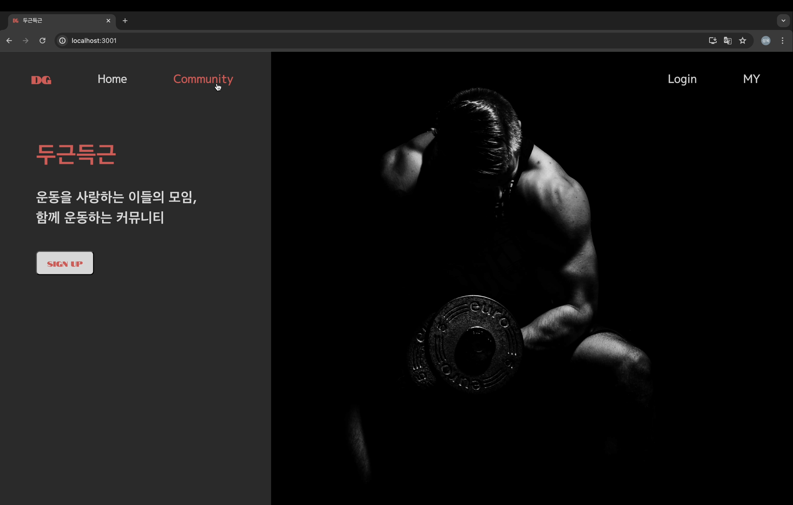
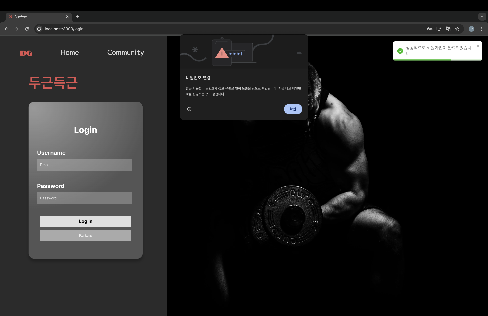
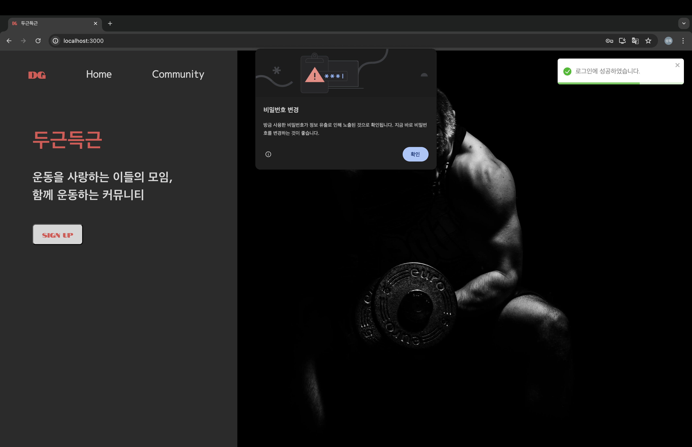
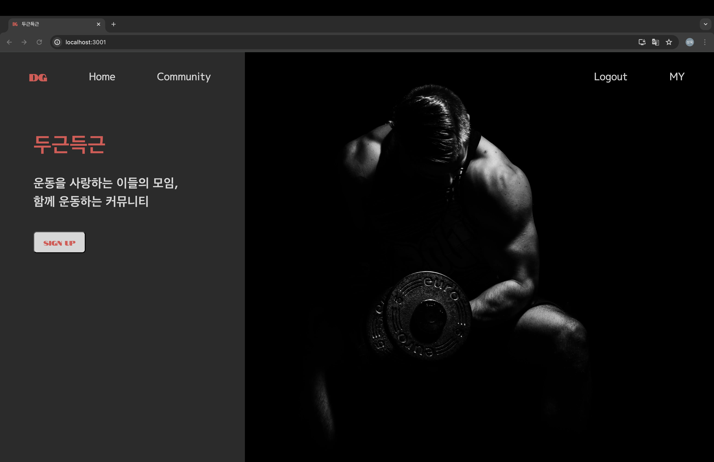
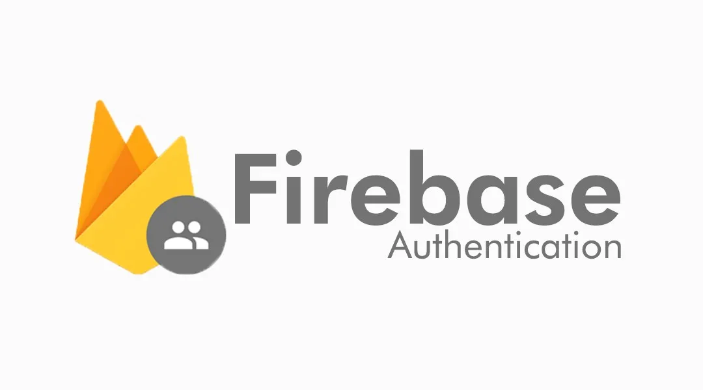
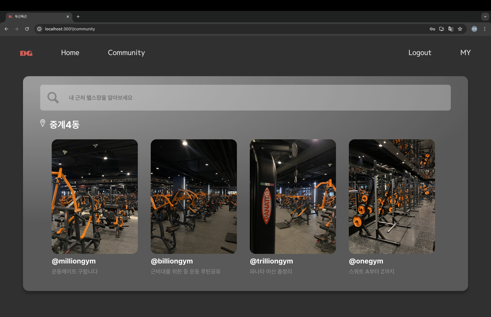
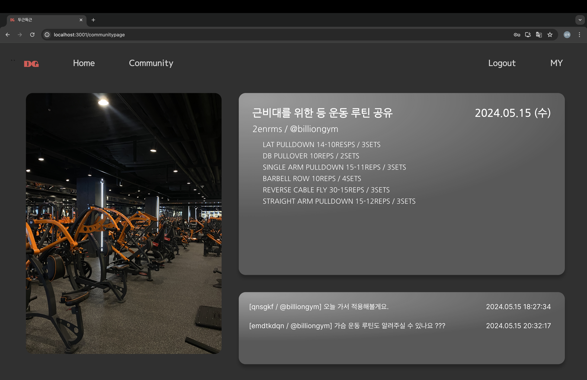
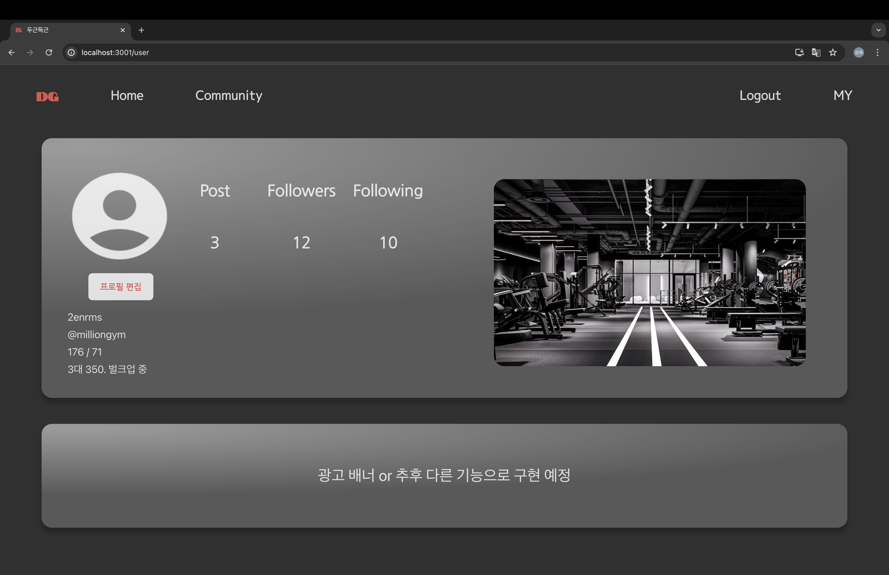

# 두근득근 (DG)
소프트웨어학부 20213029 윤성욱 - [웹클라이언트컴퓨팅] 중간대체 과제물
## 프로젝트 소개 (Introduction)
- 두근득근은 운동을 사랑하는 이들의 모여 함께 만들어 나가는 운동 커뮤니티입니다. 
- 이 서비스는 운동을 하고자 하는 모든 사람들이 함께 모여서 자신의 경험과 지식을 나누고, 다양한 운동 정보와 리소스를 얻을 수 있는 공간을 제공합니다.
- 기존에 존재하는 커뮤니티와 달리 개개인에게 최적화된 정보를 제공하기 위해, __동일한 헬스장__ 을 다니는 사람들 간의 정보 교류를 최우선시로 하였습니다.

- 시연 영상: https://youtu.be/w24rX7mh9yY
- Figma : https://www.figma.com/design/N1kgOOguu672M2w9xarxRc/

### 참고
- 두근두근 + 득근(得筋, 근육을 얻는다는 의미) => __DG__
  * 다양한 정보와 새로운 인연을 얻을 수 있다는 부분에서의 설렘과 앞으로 더 성장할 자신의 모습에 대한 설렘 -> 두근두근 
  - 운동에 진심이 되길 바라는 마음에서 '뒤질(DG)때까지 득근(DG)하자' 라는 의미를 포함하고 있습니다.

## 개발 환경 (Development Environment)
-  React 
      * JSX, styled-componet,react-toastify, react-recoil
-  Firebase - authentication
- npm - v10.5.0
- node - v21.7.0

## 실행 방법 (Set Up)
1. 프로젝트가 설치 되길 원하는 경로로 이동하여, repository를 clone 합니다.
2. `cd dg`를 통하여 프로젝트의 root 디렉토리로 이동합니다.
3. `npm install`을 입력해 실행에 필요한 JS 패키지를 설치합니다.
4. `npm start`를 통해 실행합니다.

## 주요기능 (Key Features)
[2024.5.15 기준]

### 1 ) 메뉴

- Nav는 'Home', 'Community', 'Login', 'MY'로 구성되어 있으며, 마우스 커서를 올리면 색상이 바뀌도록 효과를 주었습니다.
- 로그인이 되어 있지 않은 상태에서 Community, My 페이지로 접근하려고 한다면 로그인 페이지로 연결 되도록 설정했습니다.

### 2 ) 회원가입 및 로그인

- 회원가입이 되어 있지 않다면, Home에서 'SIGN UP' 버튼을 통해 회원가입 페이지로 이동할 수 있습니다. 
- 회원가입 진행 시 react-toastify를 이용하여 에러가 발생했거나 정상적으로 회원가입이 진행 되었을 때 상황에 맞는 알림창을 출력하도록 설정했습니다. 
- 회원가입을 성공하게 되면 자동으로 로그인 페이지로 이동하게 됩니다. 물론 Home에서 바로 로그인 페이지로 이동 가능합니다. 

- 로그인도 회원가입과 마찬가지로 react-toastify를 이용하여 상황에 맞게 알림창을 출력할 수 있도록 설정했습니다.

- 로그인이 정상적으로 완료되면 Nav의 Login은 Logout으로 변경됩니다.

- 회원가입, 로그인 등 사용자 관리를 위한 기능들은 Firebase를 이용하여 구현했습니다. 
- /src/firebase/firebase.js 파일에서 초기 설정과 관련된 내용을 확인할 수 있습니다. 
- Firebase Authentication 서비스를 이용해 Username과 Password를 받아 사용자를 인증합니다. 
- 로그인 및 로그아웃은 React의 상태관리 라이브러리 recoil을 이용하여 회원의 로그인 정보(상태)를 담고 있는 userState의 값을 초기화, 할당해줍니다.
- 회원가입 및 로그인이 정상적으로 이루어진 경우, localhost:3000/으로 redirect 됩니다.

 
### 3 ) 커뮤니티

- 이 서비스는 동일한 헬스장을 다니는 사람들간의 정보 교류를 최우선시 하였기에, 위치에 따라 헬스장을 찾을 수 있게 검색 기능을 추가하였습니다. 
- 4개의 게시물을 페이지에 띄우고 게시물의 이미지를 클릭하면 게시물로 이동하도록 구현했습니다.

- 예를 들어 두 번째 게시물에 접근하고 가정했을 때, 나오는 화면을 임의로 구현했습니다. 

#### 추가 구현 예정
- 위치 기반 서비스를 통해 사용자의 현재 위치를 기준으로 특정 지역 커뮤니티에 가입자격을 부여하고 다른 이용자와 해당 지역과 관련된 게시물을 작성할 수 있도록. (당근마켓 벤치마킹)
- 특정 기준(최신순, 인기순, 거리순)에 따라 자동으로 헬스장을 나열.
- 게시물 등록 및 수정, 댓글 작성 및 삭제 기능

### 4 ) 사용자 페이지

- 사용자의 게시물, 팔로워, 팔로잉 수를 보여주며 추가 정보(사진, 유저명, 다니는 헬스장, 신체특징, 운동 목적 등)를 작성할 수 있도록 했습니다.

#### 추가 구현 예정
- 프로필 관리 기능
- 사용자 간의 소통 창구 마련. 메시지 기능.

## 유의사항 (Precautions)
- Community와 My 페이지 접근은 로그인 이후 가능합니다.
- 회원가입 및 로그인 시 Username은 이메일 형식으로 지원 받습니다.
- 서비스 지원 가능 브라우저: Google Chrome, Safari / 추천 환경: Google Chrome